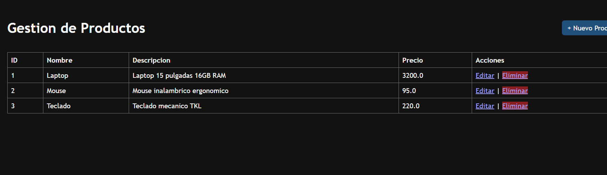
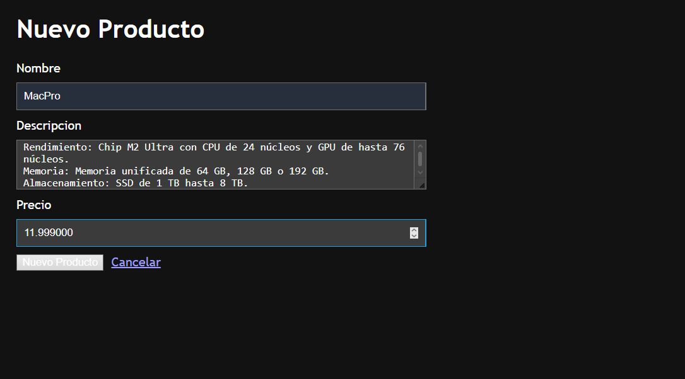
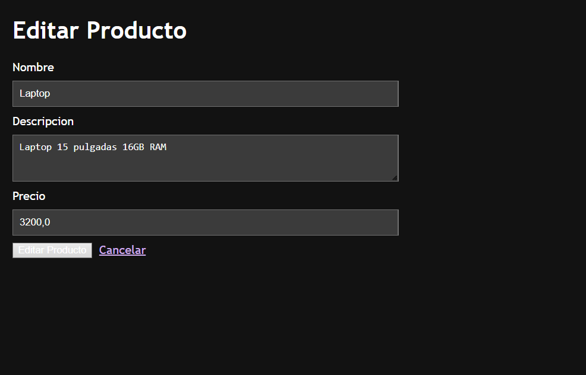

# U7 PostContenido 1 - Spring Boot MVC + Thymeleaf

Gestion de productos en memoria usando Spring Boot, patron MVC y vistas Thymeleaf.

## Requisitos
- Java 17+
- Maven 3.8+

## Ejecutar
```bash
mvn spring-boot:run
```

Abrir:
- `http://localhost:8080/productos`

## Funcionalidades
- Listado de productos
- Crear producto
- Editar producto
- Eliminar producto
- PRG en guardado y eliminacion

## Entrega GitHub
Nombre sugerido: `apellido-post1-u7`

## Capturas de Pantalla de la Aplicación

**1. Listado de Productos (Vista Principal):**


**2. Formulario de Registro (Nuevo Producto):**


**3. Formulario de Edición (Actualizar Producto):**
